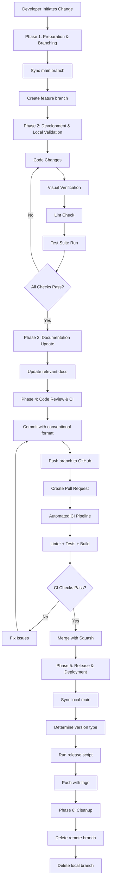
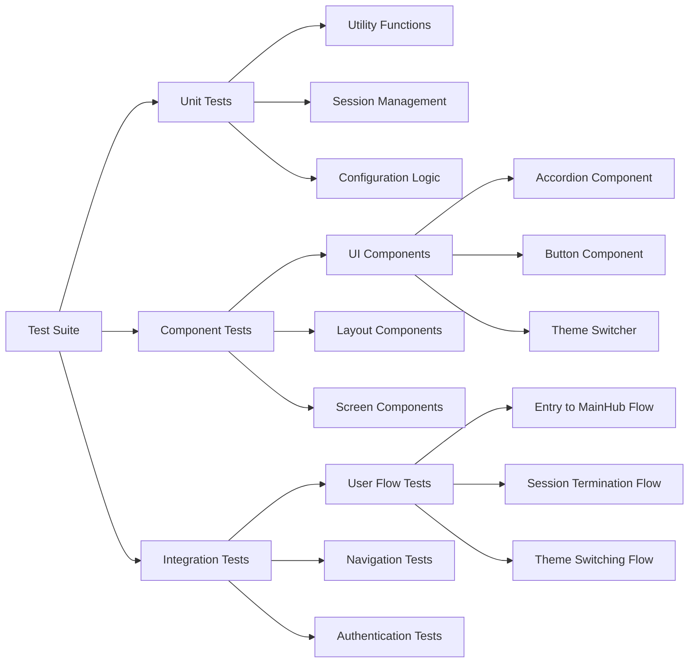
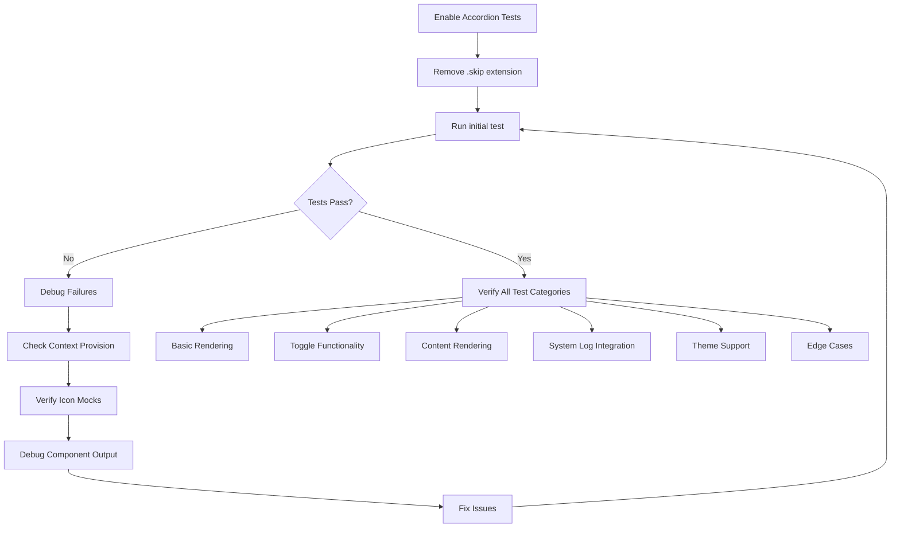
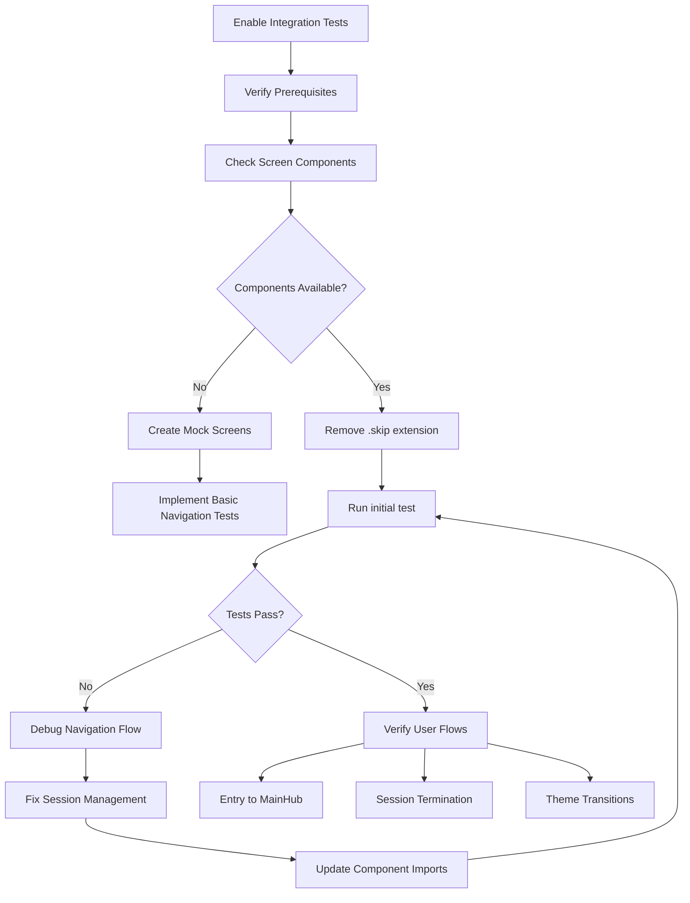

# Workflow Protocol Implementation Design

## Overview

This design outlines the implementation of a comprehensive Standard Task Workflow Protocol for the interactive terminal portfolio project. The protocol establishes a mandatory, step-by-step process for implementing changes while ensuring code quality, preventing regressions, and maintaining automated release cycles. Additionally, this design addresses the enablement and debugging of critical test suites that are currently experiencing compatibility issues.

## Technology Stack & Dependencies

### Core Technologies
- **Framework**: Next.js 15.4.3 with React 19.1.0
- **Testing**: Jest 30.0.5 with React Testing Library
- **Process Management**: Git workflow with conventional commits
- **CI/CD**: GitHub Actions for automated testing and deployment
- **Build Tools**: npm scripts for development, testing, and release management

### Testing Infrastructure
- **Jest Configuration**: Custom setup with jsdom environment
- **Mock Utilities**: Centralized mock providers and test data
- **Coverage**: V8 provider with focused utility testing
- **Component Testing**: React Testing Library with SessionContext mocking

## Component Architecture

### Workflow Protocol Components



### Test Suite Architecture



## API Endpoints Reference

### Git Workflow Commands

| Command | Purpose | Phase |
|---------|---------|-------|
| `git checkout main` | Switch to main branch | Preparation |
| `git pull origin main` | Sync with remote | Preparation |
| `git checkout -b type/description` | Create feature branch | Preparation |
| `npm run dev` | Start development server | Development |
| `npm run lint` | Code style validation | Development |
| `npm test` | Run test suite | Development |
| `git add .` | Stage changes | Code Review |
| `git commit -m "type: description"` | Conventional commit | Code Review |
| `git push origin branch-name` | Push to remote | Code Review |
| `npm run release -- --release-as type` | Create release | Release |
| `git push --follow-tags origin main` | Deploy release | Release |

### Test Execution Commands

| Command | Purpose | Scope |
|---------|---------|-------|
| `npm test` | Run all tests | Full suite |
| `npm test -- Accordion.test.js` | Run specific component test | Component |
| `npm test -- integration.test.js` | Run integration tests | User flows |
| `npm test -- --coverage` | Run with coverage report | Analysis |
| `npm test -- --watch` | Run in watch mode | Development |

## Data Models & Test Structures

### Accordion Component Test Structure

```javascript
// Test Data Model
const mockSections = [
  {
    id: 'section-1',
    title: 'About Me',
    content: 'String content'
  },
  {
    id: 'section-2', 
    title: 'Skills',
    content: [
      { type: 'text', value: 'Text content' },
      { type: 'list_item', value: 'List item' },
      { type: 'tag_list', value: ['tag1', 'tag2'] }
    ]
  }
];

// Context Requirements
const mockContextValue = {
  theme: 'dark',
  addLog: jest.fn(),
  // Other session context properties
};
```

### Integration Test Flow Structure

```javascript
// User Flow Test Model
const testFlows = [
  {
    name: 'Complete Session Flow',
    steps: [
      'Start at Entry screen',
      'Enter access code',
      'Navigate to ProfileBoot',
      'Wait for boot sequence',
      'Arrive at MainHub'
    ]
  },
  {
    name: 'Session Termination Flow',
    steps: [
      'Start authenticated at MainHub',
      'Trigger logout action',
      'Verify cleanup process',
      'Return to Entry screen'
    ]
  }
];
```

## Business Logic Layer

### Workflow Phase Implementation

#### Phase 1: Preparation & Branching
- **Objective**: Create isolated development environment
- **Prerequisites**: Git repository access, local development setup
- **Validation**: Ensure main branch is synchronized before creating feature branch
- **Branch Naming**: Follow conventional commit patterns (feat/, fix/, docs/)

#### Phase 2: Development & Local Validation
- **Objective**: Implement changes with continuous verification
- **Iterative Process**: Code → Visual Check → Lint → Test → Repeat
- **Exit Criteria**: All local checks pass successfully
- **Quality Gates**: ESLint passes, Jest tests pass, visual verification complete

#### Phase 3: Documentation Update
- **Objective**: Maintain documentation accuracy
- **Target Documents**: README.md, ARCHITECTURE.md, DESIGN-SYSTEM.md, SETUP.md
- **Automation**: CHANGELOG.md updated automatically during release
- **Validation**: Review documentation relevance to changes made

#### Phase 4: Code Review & CI
- **Objective**: Integrate changes through automated validation
- **Pull Request**: Required for all changes to main branch
- **CI Pipeline**: Linter + Tests + Build verification
- **Merge Strategy**: Squash and merge for clean history

#### Phase 5: Release & Deployment  
- **Objective**: Version and deploy changes
- **Version Types**: patch (fixes), minor (features), major (breaking)
- **Automation**: GitHub Actions handles release creation and deployment
- **Artifacts**: Git tags, GitHub releases, deployed application

#### Phase 6: Cleanup
- **Objective**: Maintain repository hygiene
- **Actions**: Delete remote and local feature branches
- **Verification**: Confirm main branch reflects merged changes

### Test Suite Enablement Logic

#### Accordion Component Testing


#### Integration Testing Strategy


## Middleware & Interceptors

### Git Hooks Integration
- **Pre-commit**: Automatic linting and basic test execution
- **Pre-push**: Full test suite execution before remote push
- **Post-merge**: Automatic dependency installation if package.json changed

### CI Pipeline Interceptors
- **Quality Gates**: Block merge until all CI checks pass
- **Automated Actions**: Release creation, deployment triggers
- **Notification System**: Status updates to development team

### Test Environment Setup
- **Mock Providers**: Centralized SessionContext mocking
- **Test Utilities**: Reusable helpers for component rendering
- **Environment Configuration**: Isolated test environment settings

## Testing Strategy

### Component Testing Approach

#### Test Categories for Accordion Component
1. **Basic Rendering Tests**
   - Verify all section titles render correctly
   - Confirm default collapsed state
   - Validate icon presence and positioning

2. **Interactive Functionality Tests**
   - Section expansion on click
   - Section collapse on second click
   - Exclusive expansion (only one section open)

3. **Content Rendering Tests**
   - String content rendering
   - Array content with mixed types
   - Object content with type properties
   - Tag list rendering with proper styling

4. **System Integration Tests**
   - Log entries for expand/collapse actions
   - Correct section ID logging
   - Theme context integration

5. **Edge Case Tests**
   - Empty sections array handling
   - Null content handling
   - Undefined content handling
   - Invalid content type handling

#### Integration Testing Framework

```javascript
// Test Structure Template
describe('User Flow: Complete Session', () => {
  beforeEach(() => {
    // Setup mock providers and initial state
  });
  
  it('should navigate from Entry to MainHub', async () => {
    // 1. Render Entry screen
    // 2. Simulate code entry
    // 3. Verify ProfileBoot transition
    // 4. Wait for boot sequence completion
    // 5. Confirm MainHub rendering
  });
  
  it('should handle session termination gracefully', async () => {
    // 1. Start at authenticated MainHub
    // 2. Trigger logout action
    // 3. Verify cleanup operations
    // 4. Confirm return to Entry screen
  });
});
```

### Test Debugging Algorithm

#### Progressive Debug Process
1. **Error Analysis**: Read error messages carefully
2. **Component Inspection**: Use `screen.debug()` to examine rendered output
3. **Context Verification**: Ensure all required context values provided
4. **Mock Validation**: Confirm external dependencies properly mocked
5. **Conditional Rendering**: Check for state-dependent rendering logic

#### Debug Tools Implementation
```javascript
// Debug Helper for Component Tests
const debugComponent = (component, props = {}) => {
  const { container } = render(
    <MockSessionProvider>
      {component}
    </MockSessionProvider>
  );
  console.log('Component HTML:', container.innerHTML);
  screen.debug();
  return { container };
};
```

### Test Coverage Requirements

#### Minimum Coverage Targets
- **Component Tests**: 90% line coverage for UI components
- **Integration Tests**: 80% coverage for critical user flows  
- **Utility Functions**: 95% coverage for business logic
- **Error Scenarios**: 100% coverage for error handling paths

#### Coverage Analysis Tools
- **V8 Provider**: Accurate instrumentation for coverage reporting
- **Focused Testing**: Prioritize critical and testable code paths
- **Exclusion Strategy**: Skip files with external dependencies in coverage

## Implementation Roadmap

### Phase 1: Workflow Protocol Setup (Week 1)
- [ ] Document current git workflow gaps
- [ ] Establish branch naming conventions
- [ ] Configure pre-commit hooks
- [ ] Set up CI pipeline validation gates
- [ ] Create workflow documentation templates

### Phase 2: Test Infrastructure Enhancement (Week 1-2)
- [ ] Audit current test utilities and mocks
- [ ] Enhance MockSessionProvider with missing functionality
- [ ] Create test debugging utilities
- [ ] Establish test data fixtures
- [ ] Document testing best practices

### Phase 3: Accordion Component Test Enablement (Week 2)
- [ ] Remove `.skip` extension from test file
- [ ] Run initial test execution and identify failures
- [ ] Debug context provision issues
- [ ] Fix icon mocking problems
- [ ] Validate content rendering for all types
- [ ] Ensure system log integration works
- [ ] Test theme context integration
- [ ] Verify edge case handling

### Phase 4: Integration Test Implementation (Week 2-3)
- [ ] Assess screen component availability
- [ ] Create mock screens if needed
- [ ] Remove `.skip` extension from integration tests
- [ ] Debug navigation flow issues
- [ ] Implement session management testing
- [ ] Create user flow test scenarios
- [ ] Validate authentication flow testing
- [ ] Ensure cleanup process testing

### Phase 5: Documentation and Training (Week 3)
- [ ] Update TESTING.md with new procedures
- [ ] Create workflow quick reference guide
- [ ] Document debugging procedures
- [ ] Train team on new protocols
- [ ] Establish workflow compliance monitoring

### Phase 6: Monitoring and Optimization (Week 4)
- [ ] Monitor workflow adoption metrics
- [ ] Collect feedback from development team
- [ ] Optimize CI pipeline performance
- [ ] Refine test execution speed
- [ ] Establish continuous improvement process

## Success Criteria

### Workflow Protocol Implementation
- [ ] 100% adherence to 6-phase workflow process
- [ ] Zero unauthorized direct commits to main branch
- [ ] Automated CI pipeline blocks non-compliant changes
- [ ] Documentation automatically updated with each release
- [ ] Average time from feature start to deployment < 1 day

### Test Suite Enablement
- [ ] Accordion.test.js executes successfully with all tests passing
- [ ] Integration.test.js executes successfully with critical flows covered
- [ ] Total test count increases from current baseline to 80+ tests
- [ ] No regression in existing test suite functionality
- [ ] Test execution time remains under 30 seconds for full suite

### Quality Improvements
- [ ] Code coverage maintained above 85% for critical components
- [ ] Zero production bugs related to workflow non-compliance
- [ ] Developer onboarding time reduced by 50% through clear protocols
- [ ] Release cycle time reduced through automation
- [ ] Team confidence in deployment process increased through testing

## Risk Mitigation

### Technical Risks
- **Test Environment Issues**: Maintain isolated test environment with comprehensive mocking
- **CI Pipeline Failures**: Implement fallback procedures and manual override capabilities
- **Dependency Conflicts**: Regular dependency audits and update procedures
- **Performance Degradation**: Monitor test execution times and optimize heavy tests

### Process Risks
- **Workflow Non-Adoption**: Provide training and establish monitoring mechanisms
- **Documentation Drift**: Automate documentation updates where possible
- **Release Process Errors**: Implement validation checks at each release step
- **Branch Management Issues**: Establish clear cleanup procedures and automation

### Operational Risks
- **Team Productivity Impact**: Gradual rollout with feedback collection
- **Knowledge Transfer Gaps**: Comprehensive documentation and training materials
- **Tool Dependency**: Backup procedures for critical development tools
- **Communication Breakdowns**: Clear escalation procedures for workflow issues