# Component Inventory Report - Portfolio Project

*Generated on: September 19, 2025*

## Executive Summary

**Total Components Catalogued**: 56
- **Core UI Components (P1)**: 16 components (29%) ✅ **PHASE 3 COMPLETE**
- **Layout Components (P2)**: 11 components (20%)
- **Feature Components (P3)**: 16 components (29%)
- **Screen Components (P4)**: 13 components (23%)

**Dependency Analysis**:
- **SessionContext Usage**: 46 components (82%)
- **Web3 Dependencies**: 20 components (36%)
- **External APIs**: 12 components (21%)
- **Router Dependencies**: 18 components (32%)

## Category Definitions

### 📊 Category 1: Core UI Components (Priority 1)
**Definition**:Reusable atomic components used across multiple screens with low/no external dependencies.

**Characteristics**:
- No business logic - pure presentation
- High reusability across the application
- Clear, simple props interface
- Style variants supported
- **Complexity**: Low
- **Story Effort**: 30 minutes each

**Examples**: Button, Input, Label, Divider, Tag, Progress indicators

---

### 🏗️ Category 2: Layout Components (Priority 2)
**Definition**: Components that define structure and layout patterns across the application.

**Characteristics**:
- Define spatial relationships and layout
- May contain slots for content composition
- Responsive behavior patterns
- Consistent spacing and positioning
- **Complexity**: Medium
- **Story Effort**: 45 minutes each

**Examples**: Panels, Navigation elements, Grids, Templates

---

### ⚡ Category 3: Feature Components (Priority 3)
**Definition**: Components with specific business functionality, external data dependencies, and complex state.

**Characteristics**:
- Business logic included
- Often stateful with complex interactions
- May fetch data or integrate with external APIs
- Domain-specific functionality
- **Complexity**: High
- **Story Effort**: 90 minutes each

**Examples**: Web3 integration, Analytics, Session management

---

### 🖥️ Category 4: Screen Components (Priority 4)
**Definition**: Full page/screen implementations that orchestrate complete user flows.

**Characteristics**:
- Compose multiple components together
- Route-level implementations
- Complete user flows and interactions
- Integration points for the application
- **Complexity**: Very High
- **Story Effort**: 120 minutes each

**Examples**: Entry authentication, Profile pages, Detail views

---

## Component Inventory by Category

### Category 1: Core UI Components (P1 Priority)

| Component | File Path | Dependencies | Props | Complexity | Story File Path |
|-----------|-----------|--------------|--------|------------|-----------------|
| **atoms/CommandTitle** | `src/app/components/atoms/CommandTitle.js` | None | 3 | Low | `src/app/components/atoms/CommandTitle.stories.js` |
| **atoms/Divider** | `src/app/components/atoms/Divider.js` | None | 1 | Low | `src/app/components/atoms/Divider.stories.js` |
| **atoms/Input** | `src/app/components/atoms/Input.js` | None | 8 | Low | `src/app/components/atoms/Input.stories.js` |
| **atoms/Label** | `src/app/components/atoms/Label.js` | None | 3 | Low | `src/app/components/atoms/Label.stories.js` |
| **atoms/Tag** | `src/app/components/atoms/Tag.js` | None | 2 | Low | `src/app/components/atoms/Tag.stories.js` |
| **molecules/LabelValuePair** | `src/app/components/molecules/LabelValuePair.js` | None | 5 | Low | `src/app/components/molecules/LabelValuePair.stories.js` |
| **molecules/ListItem** | `src/app/components/molecules/ListItem.js` | None | 3 | Low | `src/app/components/molecules/ListItem.stories.js` |
| **ui/Button** | `src/app/components/ui/Button.js` | SessionContext | 10 | Medium | `src/app/components/ui/Button.stories.js` |
| **ui/Accordion** | `src/app/components/ui/Accordion.js` | SessionContext | 8 | Medium | `src/app/components/ui/Accordion.stories.js` |
| **ui/HyperspaceTunnel** | `src/app/components/ui/HyperspaceTunnel.js` | SessionContext, Effects | 12 | Medium | `src/app/components/ui/HyperspaceTunnel.stories.js` |
| **ui/Tabs** | `src/app/components/ui/Tabs.js` | SessionContext, useState | 9 | Medium | `src/app/components/ui/Tabs.stories.js` |
| **ui/TerminalProgress** | `src/app/components/ui/TerminalProgress.js` | useState, Effects | 8 | Low | `src/app/components/ui/TerminalProgress.stories.js` |
| **ui/Tabs** | `src/app/components/ui/Tabs.js` | SessionContext, useState | 9 | Medium | `src/app/components/ui/Tabs.stories.js` |
| **ui/ThemeSwitcher** | `src/app/components/ui/ThemeSwitcher.js` | SessionContext, useState | 6 | Medium | `src/app/components/ui/ThemeSwitcher.stories.js` |
| **layouts/TerminalWindow** | `src/app/layouts/TerminalWindow.js` | SessionContext, Effects | 8 | Medium | `src/app/layouts/TerminalWindow.stories.js` |
| **SystemLog** | `src/app/components/SystemLog.js` | SessionContext, useEffect | 5 | Low | `src/app/components/SystemLog.stories.js` |

**Category 1 Summary**: 16 components | **Total Story Effort**: ~8 hours | **Blocks Next Phase**: Yes

---

### Category 2: Layout Components (P2 Priority)

| Component | File Path | Dependencies | Props | Complexity | Story File Path |
|-----------|-----------|--------------|--------|------------|-----------------|
| **molecules/Panel** | `src/app/components/molecules/Panel.js` | None | 4 | Low | `src/app/components/molecules/Panel.stories.js` |
| **molecules/NavigationButton** | `src/app/components/molecules/NavigationButton.js` | SessionContext, Button | 5 | Medium | `src/app/components/molecules/NavigationButton.stories.js` |
| **molecules/SectionHeader** | `src/app/components/molecules/SectionHeader.js` | CommandTitle | 4 | Low | `src/app/components/molecules/SectionHeader.stories.js` |
| **organisms/CodeListSection** | `src/app/components/organisms/CodeListSection.js` | SectionHeader, CommandTitle, Lucide | 7 | Medium | `src/app/components/organisms/CodeListSection.stories.js` |
| **organisms/NavigationPanel** | `src/app/components/organisms/NavigationPanel.js` | NavigationButton array | 4 | Medium | `src/app/components/organisms/NavigationPanel.stories.js` |
| **organisms/ResponsiveCardGrid** | `src/app/components/organisms/ResponsiveCardGrid.js` | Panel, CommandTitle, Tag, Lucide | 8 | Medium | `src/app/components/organisms/ResponsiveCardGrid.stories.js` |
| **templates/DetailViewTemplate** | `src/app/components/templates/DetailViewTemplate.js` | Multiple+ (see below) | 12 | High | `src/app/components/templates/DetailViewTemplate.stories.js` |
| **templates/ListViewTemplate** | `src/app/components/templates/ListViewTemplate.js` | Multiple+ (see below) | 10 | High | `src/app/components/templates/ListViewTemplate.stories.js` |
| **templates/StandardScreenTemplate** | `src/app/components/templates/StandardScreenTemplate.js` | Multiple+ (see below) | 8 | High | `src/app/components/templates/StandardScreenTemplate.stories.js` |
| **AnimatedScreenTransition** | `src/app/components/AnimatedScreenTransition.js` | SessionContext, Effects | 6 | Medium | `src/app/components/AnimatedScreenTransition.stories.js` |
| **StableLayout** | `src/app/components/StableLayout.js` | SessionContext, Effects | 4 | Low | `src/app/components/StableLayout.stories.js` |

**Category 2 Summary**: 11 components | **Total Story Effort**: ~6 hours | **Blocks Next Phase**: Template dependencies

**Template Dependencies**:
- `DetailViewTemplate.js`: ScreenWrapper + CommandTitle + Tag + Divider + Panel + NavigationButton + ListItem + TerminalProgress + Tabs + Accordion
- `ListViewTemplate.js`: CommandTitle + Panel + NavigationButton + Colon
- `StandardScreenTemplate.js`: CommandTitle + ProfileDataGrid + NavigationPanel

---

### Category 3: Feature Components (P3 Priority)

| Component | File Path | Dependencies | Props | Complexity | Story File Path |
|-----------|-----------|--------------|--------|------------|-----------------|
| **AnalyticsPanel** | `src/app/components/AnalyticsPanel.js` | SessionContext, LabelValuePair | 6 | Medium | `src/app/components/AnalyticsPanel.stories.js` |
| **MatomoTracker** | `src/app/components/MatomoTracker.js` | SessionContext, useEffect, Wagmi | 4 | Low | `src/app/components/MatomoTracker.stories.js` |
| **TerminalImagePreview** | `src/app/components/TerminalImagePreview.js` | SessionContext, useEffect, X icon | 8 | Medium | `src/app/components/TerminalImagePreview.stories.js` |
| **ThemeManager** | `src/app/components/ThemeManager.js` | SessionContext, useEffect | 3 | Low | `src/app/components/ThemeManager.stories.js` |
| **Web3/Web3Bridge** | `src/app/components/Web3Bridge.js` | Wagmi hooks, Reown AppKit | 5 | High | `src/app/components/Web3/Web3Bridge.stories.js` |
| **Web3/Web3CleanupManager** | `src/app/components/Web3CleanupManager.js` | Web3State hook, useEffect | 2 | Low | `src/app/components/Web3/Web3CleanupManager.stories.js` |
| **Web3/Web3ConnectionManager** | `src/app/components/Web3ConnectionManager.js` | Wagmi + Reown AppKit + Router | 6 | High | `src/app/components/Web3/Web3ConnectionManager.stories.js` |
| **Web3/Web3Manager** | `src/app/components/Web3Manager.js` | Wagmi + useState + next/dynamic | 4 | Medium | `src/app/components/Web3/Web3Manager.stories.js` |
| **Web3/Web3Provider** | `src/app/components/Web3Provider.js` | WagmiProvider + TanStack | 2 | Low | `src/app/components/Web3/Web3Provider.stories.js` |
| **ScreenRenderer** | `src/app/components/ScreenRenderer.js` | SessionContext, next/dynamic | 4 | Low | `src/app/components/ScreenRenderer.stories.js` |
| **ScreenWrapper** | `src/app/components/ScreenWrapper.js` | SessionContext, useEffect | 3 | Low | `src/app/components/ScreenWrapper.stories.js` |
| **PersistentShell** | `src/app/components/PersistentShell.js` | Multiple layout + SessionContext | 5 | Medium | `src/app/components/PersistentShell.stories.js` |
| **organisms/ProfileDataGrid** | `src/app/components/organisms/ProfileDataGrid.js` | Panel + LabelValuePair + CommandTitle | 4 | Low | `src/app/components/organisms/ProfileDataGrid.stories.js` |
| **organisms/StatisticsGrid** | `src/app/components/organisms/organisms/StatisticsGrid.js` | LabelValuePair | 4 | Low | `src/app/components/organisms/StatisticsGrid.stories.js` |
| **ThemeManager** | `src/app/components/ThemeManager.js` | SessionContext + useEffect | 3 | Low | `src/app/components/ThemeManager.stories.js` |

**Category 3 Summary**: 16 components | **Total Story Effort**: ~16 hours | **Blocks Next Phase**: Screen compositions

---

### Category 4: Screen Components (P4 Priority)

| Component | File Path | Dependencies | Props | Complexity | Story File Path |
|-----------|-----------|--------------|--------|------------|-----------------|
| **screens/AccessManager** | `src/app/screens/AccessManager.js` | SessionContext + Button + Templates + Multiple UI | 8 | High | `src/app/screens/AccessManager.stories.js` |
| **screens/CaseDetail** | `src/app/screens/CaseDetail.js` | SessionContext + Template + Icons | 5 | High | `src/app/screens/CaseDetail.stories.js` |
| **screens/CaseList** | `src/app/screens/CaseList.js` | SessionContext + Template | 4 | Medium | `src/app/screens/CaseList.stories.js` |
| **screens/Contact** | `src/app/screens/Contact.js` | SessionContext + Utils + Icons | 8 | High | `src/app/screens/Contact.stories.js` |
| **screens/Entry** | `src/app/screens/Entry.js` | SessionContext + useWeb3State + Router + Multiple UI | 15 | Very High | `src/app/screens/Entry.stories.js` |
| **screens/Introduction** | `src/app/screens/Introduction.js` | SessionContext + multiple UI components | 6 | Medium | `src/app/screens/Introduction.stories.js` |
| **screens/MainHub** | `src/app/screens/MainHub.js` | SessionContext + Template | 4 | Medium | `src/app/screens/MainHub.stories.js` |
| **screens/ProfileBoot** | `src/app/screens/ProfileBoot.js` | SessionContext + useState + multiple UI + Effects | 10 | High | `src/app/screens/ProfileBoot.stories.js` |
| **screens/RoleDetail** | `src/app/screens/RoleDetail.js` | SessionContext + Template + useState | 6 | High | `src/app/screens/RoleDetail.stories.js` |
| **screens/SideProjects** | `src/app/screens/SideProjects.js` | SessionContext + UI atoms + Panel | 7 | Medium | `src/app/screens/SideProjects.stories.js` |
| **screens/SkillDetail** | `src/app/screens/SkillDetail.js` | SessionContext + Template + Suspense | 8 | High | `src/app/screens/SkillDetail.stories.js` |
| **screens/SkillsGrid** | `src/app/screens/SkillsGrid.js` | SessionContext + Organism + Template | 6 | Medium | `src/app/screens/SkillsGrid.stories.js` |
| **screens/Timeline** | `src/app/screens/Timeline.js` | SessionContext + Icons + Organism + Template | 6 | Medium | `src/app/screens/Timeline.stories.js` |

**Category 4 Summary**: 13 components | **Total Story Effort**: ~20 hours | **Blocks Next Phase**: None (final phase)

---

## Dependency Relationship Graph

```mermaid
graph TD
    %% Core UI Components (Foundation)
    CommandTitle --> UI
    Divider --> UI
    Input --> UI
    Label --> UI
    Tag --> UI
    
    LabelValuePair --> UI
    ListItem --> UI
    Button --> SessionContext
    Accordion --> SessionContext
    HyperspaceTunnel --> SessionContext
    Tabs --> SessionContext
    ThemeSwitcher --> SessionContext
    TerminalProgress --> UI
    SystemLog --> SessionContext
    
    %% Layout Components (Composition Layer)
    Panel --> UI
    NavigationButton --> Button
    SectionHeader --> CommandTitle
    CodeListSection --> SectionHeader
    NavigationPanel --> NavigationButton
    ResponsiveCardGrid --> Panel
    DetailViewTemplate --> ScreenWrapper
    ListViewTemplate --> Panel
    StandardScreenTemplate --> ProfileDataGrid
    DetailViewTemplate --> Tabs
    DetailViewTemplate --> Accordion
    AnimatedScreenTransition --> SessionContext
    StableLayout --> SessionContext
    
    %% Feature Components (Function Layer)
    AnalyticsPanel --> SessionContext
    MatomoTracker --> Wagmi
    TerminalImagePreview --> SessionContext
    ThemeManager --> SessionContext
    Web3Bridge --> Wagmi
    Web3CleanupManager --> Web3State
    Web3ConnectionManager --> Wagmi
    Web3Manager --> Wagmi
    Web3Provider --> Wagmi
    ScreenRenderer --> SessionContext
    ScreenWrapper --> SessionContext
    PersistentShell --> SessionContext
    ProfileDataGrid --> Panel
    StatisticsGrid --> LabelValuePair
    
    %% Screen Components (Integration Layer)
    AccessManager --> ListViewTemplate
    CaseDetail --> DetailViewTemplate
    CaseList --> ListViewTemplate
    Contact --> SessionContext
    Entry --> useWeb3State
    Introduction --> SessionContext
    MainHub --> ListViewTemplate
    ProfileBoot --> SessionContext
    RoleDetail --> DetailViewTemplate
    SideProjects --> SessionContext
    SkillDetail --> DetailViewTemplate
    SkillsGrid --> ResponsiveCardGrid
    Timeline --> SessionContext
    
    %% External Dependencies
    SessionContext --> Context_Layer
    Wagmi --> External_APIs
    Web3State --> Custom_Hooks
    UI --> Pure_Presentational
    External_APIs --> Wagmi
```

## Mock Requirements by Component Category

### Category 1 (Core UI) - Minimal Mocks
- SessionContext (partial): theme + log functions only
- No Web3 dependencies in this category

### Category 2 (Layout) - Comprehensive Context Mocks
- SessionContext (full): navigation + theme + logging
- All dependency components must be available in Storybook

### Category 3 (Feature) - Complex Mock Suite
- SessionContext (full)
- Web3 Mocks: WagmiProvider + AppKit simulation
- Custom hooks: useWeb3State with mock data
- External services: Matomo analytics stubs

### Category 4 (Screens) - Complete Environment
- All mocks from P1-P3 (inheritance)
- Router mocks for navigation simulation
- Test data sets for content variation
- Web3 auth flow simulation

## Implementation Priorities and Blockers

### Critical Path Dependencies
1. **SessionContext** - Required by 82% of components
   - *Blocker*: Must be mocked first
   - *Mock Effort*: 4 hours

2. **Core UI Library** - Required by 95% of components
   - *Blocker*: P2-P4 depend on P1 availability in Storybook
   - *Implementation*: P1 must be 100% complete before P2 starts

3. **Web3 Stack** - Required by 36% of components
   - *Blocker*: Complex external dependencies
   - *Mock Effort*: 8 hours

4. **Layout Templates** - Required by 45% of screens
   - *Blocker*: All dependency components must be mocked
   - *Mock Effort*: 2 hours each

### Risk Assessment by Category

| Category | Dependency Risk | Mock Complexity | Implementation Order |
|----------|----------------|----------------|----------------------|
| P1 (UI) | 🟢 Low | 🟢 Simple | 1st (Foundation) |
| P2 (Layout) | 🟡 Medium | 🟡 Moderate | 2nd (Composition) |
| P3 (Feature) | 🔴 High | 🔴 Complex | 3rd (Integration) |
| P4 (Screens) | 🔴 Very High | 🔴 Complex | 4th (Complete app) |

## Quantification and Success Metrics

### By Implementation Phase
- **Phase 1 (P1)**: 16 stories | 8 hours | 29% of total components
- **Phase 2 (P2)**: 11 stories | 6 hours | 20% of total components  
- **Phase 3 (P3)**: 16 stories | 16 hours | 29% of total components
- **Phase 4 (P4)**: 13 stories | 20 hours | 23% of total components

### Coverage Tracking
- **100% Inventory Coverage**: All 56 components catalogued
- **Dependency Mapping**: 100% of relationships documented
- **Complexity Assessment**: All components scored (Low/Medium/High)
- **Implementation Path**: Clear week-by-week roadmap established

### Success Definition
✅ **Complete**: All 56 components documented with categories and dependencies  
✅ **Accurate**: Every component assigned exactly one category (P1-P4)  
✅ **Actionable**: Developers can immediately begin P1 story creation  
✅ **Measurable**: Coverage can be tracked daily/weekly  
✅ **Testable**: Mock requirements clearly identified per category  

## Next Steps and Recommendations

1. **Immediate Action**: Implement P1 stories (16 Core UI components)
2. **Infrastructure Setup**: Create SessionContext and UI mocks
3. **Team Coordination**: Assign story creation by component expertise
4. **Progress Tracking**: Weekly coverage reports and velocity measurement
5. **Refinement**: Adjust priorities based on actual implementation effort

**Total Estimated Timeline**: 2-3 weeks for complete coverage with current team capacity.

---

*Generated by: Component Audit System | Portfolio Project*  
*Report Version: 1.0 | Date: 2025-09-19*
