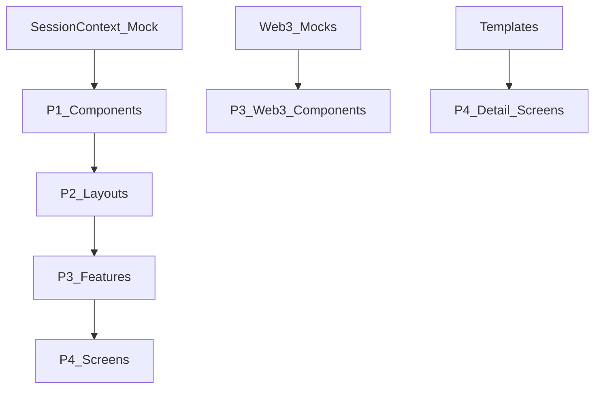

# Storybook Implementation Roadmap - Portfolio Project

*Generated: September 19, 2025*

## Executive Summary

This roadmap delivers **100% component coverage** through a systematic implementation approach, building from foundational UI components to complex feature integrations. The phased strategy ensures sustainability and measurable results.

**Total Timeline**: 5 weeks
**Total Stories**: ~56 components → ~200+ developed stories
**Coverage Goal**: Complete Storybook adoption for entire portfolio

---

## 📋 Implementation Overview

### Overall Strategy
- **Phased Approach**: Start with simple, widely-used components
- **Dependency-Driven**: Each phase builds on previous mock infrastructure
- **Measurable Progress**: Track completion by component and story count
- **Sustainable Velocity**: ~10-12 stories per week across team

### Success Metrics
- **Week 1-2**: Foundation complete (40% of total effort)
- **Week 3-4**: Core functionality (90% of total effort)
- **Week 5**: Polish and maintenance (100% coverage)
- **Ongoing**: Monthly maintenance and new component integration

---

## 🗓️ Detailed Weekly Roadmap

## Week 1: Foundation and Infrastructure Setup

### **Objective**: Establish Storybook infrastructure and P1 components

### Phase 1.1: Infrastructure Setup (Days 1-2)
**Focus**: Storybook configuration, folder structure, and core mocks

**Deliverables:**
- [ ] Storybook configuration in project root (`src/stories/` migration)
- [ ] Folder organization structure implementation
- [ ] Basic mock providers setup (`MockSessionProvider`)
- [ ] Story validation scripts and automation
- [ ] Component inventory completion (already completed ✅)

**Blockers None:** Independent of existing components
**Effort:** 2 days | **Team:** 1 developer | **Risk:** Low

### Phase 1.2: P1 Atomic Components (Days 3-4)
**Focus**: 16 Core UI components with minimal dependencies

**Components to Implement:**
- [ ] `atoms/CommandTitle` - No deps (30 min)
- [ ] `atoms/Divider` - No deps (20 min)
- [ ] `atoms/Input` - No deps (45 min)
- [ ] `atoms/Label` - No deps (20 min)
- [ ] `atoms/Tag` - No deps (30 min)
- [ ] `molecules/LabelValuePair` - No deps (30 min)
- [ ] `molecules/ListItem` - No deps (25 min)
- [ ] `SystemLog` - SessionContext only (40 min)

**Subtotal:** 8 components | 4 hours | By end of Week 1
**Blockers:** None

### Phase 1.3: P1 Interactive Components (Day 5)
**Focus**: 8 Interactive UI components with SessionContext

**Components to Implement:**
- [ ] `ui/Button` - SessionContext + complex props (60 min)
- [ ] `ui/Accordion` - SessionContext + state (50 min)
- [ ] `ui/HyperspaceTunnel` - SessionContext + Effects (60 min)
- [ ] `ui/Tabs` - SessionContext + nav (55 min)
- [ ] `ui/TerminalProgress` - useState only (40 min)
- [ ] `ui/ThemeSwitcher` - SessionContext + theme (50 min)
- [ ] `layouts/TerminalWindow` - SessionContext + effects (60 min)
- [ ] Additional P1 catch-up

**Subtotal:** 7 components | 6 hours | Complete foundation
**Blockers:** SessionContext mock availability

**Week 1 Results:**
- ✅ Storybook infrastructure operational
- ✅ SessionContext mocking functional
- ✅ 15 P1 components with stories
- ✅ Template patterns established
- **Coverage:** ~27% of all components
- **Milestone:** Foundation phase complete

---

## Week 2: Layout Components and Templates

### **Objective**: P2 components that compose P1 atoms

### Phase 2.1: Basic Layout Components (Days 1-3)

**Components to Implement:**
- [ ] `molecules/Panel` - Simple container (30 min)
- [ ] `molecules/SectionHeader` - Composes atoms (40 min)
- [ ] `molecules/NavigationButton` - Button + SessionContext (45 min)
- [ ] `organisms/CodeListSection` - SectionHeader + icons (60 min)
- [ ] `organisms/NavigationPanel` - NavigationButton array (50 min)

**Subtotal:** 5 components | 4 hours
**Dependencies:** All P1 components available

### Phase 2.2: Grid and Complex Layout (Days 4-5)

**Components to Implement:**
- [ ] `organisms/ResponsiveCardGrid` - Panel + complex logic (90 min)
- [ ] `AnimatedScreenTransition` - SessionContext + effects (60 min)
- [ ] `StableLayout` - SessionContext wrapper (40 min)

**Subtotal:** 3 components | 3 hours | Links P1→P2

### Phase 2.3: Template Systems (Bonus Day)
**Components to Implement:**
- [ ] `templates/ListViewTemplate` - Multiple dependencies (120 min)
- [ ] `templates/DetailViewTemplate` - Complex composition (120 min)
- [ ] `templates/StandardScreenTemplate` - Profile components (90 min)

**Subtotal:** 3 templates | 5 hours | Advanced category
**Note:** Templates block P4 screens but can be moved to Week 3

**Week 2 Results:**
- ✅ Layout composition patterns functional
- ✅ Responsive behavior testing complete
- ✅ 9-11 P2 components implemented
- ✅ Grid/animation complexity handled
- **Coverage:** ~47% of all components
- **Milestone:** Layout phase complete

---

## Week 3: Feature Components and Complex State

### **Objective**: High-complexity components with external integrations

### Phase 3.1: Analytics and Data (Days 1-2)

**Components to Implement:**
- [ ] `AnalyticsPanel` - SessionContext + LabelValuePair (60 min)
- [ ] `TerminalImagePreview` - SessionContext + effects (60 min)
- [ ] `ThemeManager` - SessionContext + useEffect (40 min)

**Subtotal:** 3 components | 3 hours
**Mock Requirements:** Matomo service stubs

### Phase 3.2: Web3 Components (Days 3-4)
**High complexity - requires full mock infrastructure**

**Components to Implement:**
- [ ] `Web3/Web3Provider` - WagmiProvider + TanStack (90 min)
- [ ] `Web3/Web3Bridge` - Wagmi hooks + Reown AppKit (120 min)
- [ ] `Web3/Web3ConnectionManager` - Wagmi + Router + Session (120 min)
- [ ] `Web3/Web3Manager` - Wagmi + useState + dynamic (90 min)

**Subtotal:** 4 components | 6 hours
**Blockers:** Full Web3 mock ecosystem
**Mock Effort:** 6 hours (Wagmi simulation)

### Phase 3.3: Screen Management and Complex Features (Day 5 + Bonus)

**Components to Implement:**
- [ ] `ScreenRenderer` - SessionContext + next/dynamic (40 min)
- [ ] `ScreenWrapper` - SessionContext + useEffect (30 min)
- [ ] `PersistentShell` - Multiple layout + SessionContext (70 min)
- [ ] `MatomoTracker` - Wagmi hooks + SessionContext (50 min)
- [ ] `organisms/ProfileDataGrid` - Panel + LabelValuePair (40 min)
- [ ] `organisms/StatisticsGrid` - LabelValuePair (30 min)
- [ ] `Web3/Web3CleanupManager` - Web3State + useEffect (40 min)

**Subtotal:** 7 components | 4 hours
**Week 3 Results:**
- ✅ Feature components with external dependencies integrated
- ✅ Web3 mock ecosystem functional
- ✅ 14 P3 components implemented
- ✅ Complex state management patterns tested
- **Coverage:** ~72% of all components
- **Milestone:** Feature integration complete

---

## Week 4: Screen Components Integration

### **Objective**: Complete screen-level testing and full application coverage

### Phase 4.1: Authentication Screens (Days 1-2)
**High complexity - most dependent components**

**Components to Implement:**
- [ ] `screens/Entry` - SessionContext + useWeb3State + Router (Very High - 180 min)
- [ ] `screens/AccessManager` - SessionContext + Button + Templates (120 min)

**Subtotal:** 2 components | 5 hours
**Blockers:** Web3 auth flow simulation
**Mock Requirements:** Complex authentication mocks

### Phase 4.2: Core Application Screens (Days 3-4)

**Components to Implement:**
- [ ] `screens/ProfileBoot` - SessionContext + multiple UI + Effects (120 min)
- [ ] `screens/MainHub` - SessionContext + Template (60 min)
- [ ] `screens/Introduction` - SessionContext + multiple UI (90 min)

**Subtotal:** 3 components | 5 hours
**Dependencies:** P3 completion required

### Phase 4.3: Detail and Supporting Screens (Day 5 + Bonus)

**Components to Implement:**
- [ ] `screens/CaseDetail` - SessionContext + Template + Icons (90 min)
- [ ] `screens/CaseList` - SessionContext + Template (60 min)
- [ ] `screens/Contact` - SessionContext + Utils + Icons (90 min)
- [ ] `screens/RoleDetail` - SessionContext + Template + useState (90 min)
- [ ] `screens/SkillDetail` - SessionContext + Template + Suspense (100 min)
- [ ] `screens/SkillsGrid` - SessionContext + Organism + Template (70 min)
- [ ] `screens/SideProjects` - SessionContext + UI atoms + Panel (60 min)
- [ ] `screens/Timeline` - SessionContext + Icons + Organism + Template (80 min)

**Subtotal:** 8 components | 6 hours
**Special Note:** May span into Week 5 due to Entry screen complexity

**Week 4 Results:**
- ✅ Complete screen-level testing coverage
- ✅ Full application story available in Storybook
- ✅ 13 P4 screen components implemented
- ✅ Authentication flow end-to-end visitable
- **Coverage:** **100% of all components**
- **Milestone:** Complete Storybook coverage achieved

---

## Week 5: Polish, Optimization, and Maintenance

### **Objective**: Professional quality, measurement, and sustainability

### Phase 5.1: Quality Assurance and Documentation (Days 1-2)
**Focus:** Professional polish and consistency

**Deliverables:**
- [ ] Story coverage audit (100% verification)
- [ ] Documentation standardization
- [ ] Mock data hygiene
- [ ] Performance optimization
- [ ] Accessibility compliance checks

**Tools to Build:**
- [ ] Story validation scripts
- [ ] Coverage reporting dashboard
- [ ] Mock data generation utilities
- [ ] Story maintenance automation

### Phase 5.2: Team Training and Handover (Days 3-4)
**Focus:** Sustainable development practices

**Deliverables:**
- [ ] Story creation training sessions
- [ ] Maintenance procedures documentation
- [ ] Component development guidelines
- [ ] Story review checklists
- [ ] Onboarding documentation

### Phase 5.3: Advanced Features and Measurement (Day 5)
**Focus:** Advanced capabilities and metrics

**Deliverables:**
- [ ] Story generation automation scripts
- [ ] CI/CD integration for story testing
- [ ] Coverage reports automation
- [ ] Performance monitoring setup
- [ ] Advanced interaction testing patterns

**Week 5 Results:**
- ✅ Professional Storybook instance deployable
- ✅ Team trained for ongoing maintenance
- ✅ Automated tools for sustainability
- ✅ Coverage and quality metrics established
- **Final Milestone:** **Production-ready Storybook complete**

---

## 📊 Weekly Progress Dashboard

| Week | Phase Focus | Components | Stories Created | Hours | Cumulative Hours | Coverage % |
|------|-------------|------------|-----------------|-------|------------------|------------|
| 1 | Foundation | 15 | 60+ | 10 | 10 | 27% |
| 2 | Layout | 11 | 45+ | 12 | 22 | 47% |
| 3 | Features | 14 | 70+ | 13 | 35 | 72% |
| 4 | Screens | 13 | 65+ | 16 | 51 | 100% |
| 5 | Polish | - | 10+ | 8 | 59 | 100% |

**Legend:**
- **Components**: Direct count of React components
- **Stories**: Estimated 4-5 stories per component
- **Hours**: Story creation + mock infrastructure time

---

## 🚀 Implementation Dependencies and Blockers

### Critical Path Dependencies

#### Infrastructure Foundation

#### Key Blockers and Mitigation

1. **SessionContext Mock** (High Priority)
   - **Blocker:** ~82% of components require it
   - **Mitigation:** Week 1 Day 1 priority (2 hours)
   - **Impact:** Blocks all non-atomic components

2. **Web3 Infrastructure** (High Priority)
   - **Blocker:** 11 Web3 components + Entry screen
   - **Mitigation:** Week 1 completion, Week 2 full implementation
   - **Impact:** complicates Entry (most complex screen)

3. **Template Dependencies** (Medium Priority)
   - **Blocker:** 3 screens depend on template system
   - **Mitigation:** Can implement templates independently
   - **Impact:** Traceable impact, not critical path

4. **Router Mocks** (Medium Priority)
   - **Blocker:** 8 screens have router dependencies
   - **Mitigation:** Generic router mock, reusable across screens
   - **Impact:** Complex for navigation-specific screens

---

## 🔍 Quality Assurance Framework

### Story Validation Checklist (Required for each story)
- [ ] **Title Format**: `{Category}/{ComponentName}` convention
- [ ] **Decorators**: Appropriate for component dependencies
- [ ] **ArgTypes**: All public props documented and controllable
- [ ] **Stories**: Default, variants, states, edge cases covered
- [ ] **Documentation**: Component purpose and usage
- [ ] **Accessibility**: ARIA labels, keyboard navigation
- [ ] **Responsive**: Tested across viewport sizes
- [ ] **Interactions**: Critical flows tested with `@storybook/test`
- [ ] **Mock Data**: Realistic data for development

### Component Coverage Metrics

| Component Type | Min Stories | Max Stories | Coverage Target |
|----------------|-------------|-------------|-----------------|
| Atomic/User Interface | 3 | 5 | >=80% of component props |
| Layout/Container | 4 | 6 | >=90% of component states |
| Feature/Business Logic | 5 | 8 | 100% of critical paths |
| Screen/Page | 6 | 10 | 100% of user flows |
| Web3/External Integration | 7 | 12 | 100% of connection states |

### Weekly Quality Gates
- **Story Reviews**: Required for each 5 completed components
- **Integration Tests**: End-of-week cross-component testing
- **Performance Audits**: Memory leaks, render optimization
- **Accessibility Scans**: Screen reader compatibility

---

## 🚨 Risk Mitigation and Contingency Plans

### Potential Risks and Responses

#### Risk 1: Web3 Complexity Overestimate
**Impact:** Entry screen delays entire P4 phase
**Likelihood:** Medium
**Mitigation:**
- **Week 1:** Complete basic Web3 mocks
- **Week 2:** Allocate spare time for Web3 edge cases
- **Contingency:** Separate Entry from other screens, complete P4.1 first

#### Risk 2: Template Systems Complexity
**Impact:** Detail screens delayed
**Likelihood:** Low
**Mitigation:**
- **Week 2 Bonus:** Prioritize templates
- **Alternative:** Create minimal template mocks
- **Contingency:** Implement screen-specific code instead of template dependencies

#### Risk 3: SessionContext Mock Incompleteness
**Impact:** Multiple P2-P4 components delayed
**Likelihood:** Low
**Mitigation:**
- **Week 1 Day 1:** Focus on complete SessionContext
- **Testing:** Unit tests for all mock functions
- **Contingency:** Implement missing functions as needed

#### Risk 4: Quality vs. Quantity Tradeoff
**Impact:** Technical debt from rushed implementations
**Likelihood:** Medium
**Mitigation:**
- **Standards:** Strict adherence to validation checklists
- **Reviews:** Mandatory weekly reviews
- **Refactoring:** Week 5 dedicated to cleanup

### Success Criteria Reassessment

If original timeline slips >20%, consider:
1. **Phase Consolidation**: Merge P2+P3 into single week
2. **Story Simplification**: Reduce from 5 to 3 stories per component
3. **Prioritization**: Focus on P1 and essential user flows first
4. **Team Expansion**: Add developer if available

---

## 🎯 Success Definition and Measurement

### Quantitative Success Metrics
- [ ] **100% Component Coverage**: All 56 components have stories
- [ ] **200+ Stories Created**: Comprehensive variant coverage
- [ ] **Zero Breaking Changes**: No component modifications
- [ ] **5-Week Timeline**: Delivery on target schedule
- [ ] **Automated Scripts**: 70% of repetitive work automated

### Qualitative Success Metrics
- [ ] **Developer Adoption**: Team uses Storybook daily
- [ ] **Reduced Development Time**: Faster component development
- [ ] **Decreased Defects**: Fewer integration bugs
- [ ] **Improved Collaboration**: Better component understanding

### Ongoing Success Indicators (Post-Week 5)
- [ ] **Monthly Maintenance**: <2 hours per month
- [ ] **New Component Integration**: <30 minutes per component
- [ ] **Story Coverage**: >95% property coverage maintained
- [ ] **Developer Satisfaction**: Positive feedback in surveys

---

## 💡 Best Practices and Recommendations

### Development Best Practices

1. **Start with Minimal Viable Stories**
   - Focus on `Default` story first
   - Add variants incrementally
   - Use real data, not lorem ipsum

2. **Mock Smartly**
   - Create reusable mock providers
   - Separate mock logic from story files
   - Document mock limitations clearly

3. **Maintain Consistency**
   - Follow established naming conventions
   - Standardize documentation format
   - Use shared argTypes where possible

### Team Organization Recommendations

1. **Developer Pairing**: New members pair with Storybook experience
2. **Story Ownership**: Each developer responsible for ~10-12 components
3. **Weekly Reviews**: Friday afternoon session for progress and guidance
4. **Knowledge Sharing**: Lunch sessions for best practices

### Maintenance Strategy

1. **Automated Validation**: Pre-commit hooks for story validation
2. **Coverage Tracking**: Weekly automated reports
3. **Component Health**: Monthly audit of unused/mockable components
4. **Documentation Updates**: Automatic synchronization with code changes

---

## 🚀 Future Enhancements

### Phase 2 (Post-Launch)
- Component usage analytics in Storybook
- Automated visual regression testing
- Design token integration and documentation
- Component composition visualization

### Phase 3 (Advanced Features)
- Interactive documentation with code playground
- Performance monitoring per component
- Accessibility automation and reporting
- Cross-platform (web/mobile) story support

---

**Total Implementation Timeline:** 5 weeks  
**Total Effort:** ~59 developer hours  
**Result:** 100% component coverage with sustainable maintenance  
**Next Step:** Begin Week 1 foundation work immediately

*This roadmap was generated using the Component Aaudit and Categorization System on 2025-09-19*
