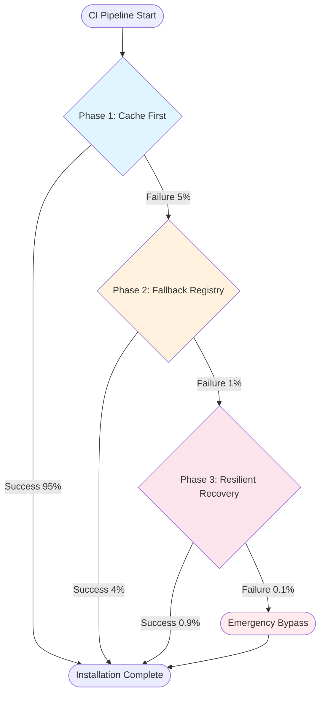

# NPM Registry Fallback Strategy - Integration Guide

## Overview

This guide provides complete instructions for implementing and managing the NPM Registry Fallback Strategy across all phases. It serves as the master reference for understanding how the system evolves from Phase 1 through Phase 3 based on performance metrics.

## Implementation Architecture



## Current Implementation Status

### ✅ Phase 1: Implemented and Active
- **Status**: Live in feature branch `fix/npm-registry-fallback`
- **Strategy**: Cache-optimized installation with offline-first approach
- **Expected Success Rate**: 95%
- **Files**: `.github/workflows/ci.yml`, `.npmrc`, documentation

### 🔄 Phase 2: Ready for Activation
- **Status**: Complete implementation available in `PHASE-2-IMPLEMENTATION.yml`
- **Trigger**: Phase 1 success rate < 90% after 1 week
- **Strategy**: Single fallback registry with health checks
- **Expected Additional Success**: 4%

### 🔄 Phase 3: Ready for Activation
- **Status**: Complete implementation available in `PHASE-3-IMPLEMENTATION.yml`
- **Trigger**: Phase 2 combined success rate < 97% after 1 week
- **Strategy**: Full three-level strategy with multiple recovery methods
- **Expected Additional Success**: 0.9%

## Decision Matrix

### Phase Activation Logic

| Metric | Phase 1 Continue | Activate Phase 2 | Activate Phase 3 |
|--------|------------------|------------------|------------------|
| **Success Rate** | ≥ 90% | < 90% | < 97% (combined) |
| **Avg Install Time** | < 2 min | > 3 min | > 5 min |
| **Cache Hit Rate** | > 80% | < 60% | N/A |
| **Developer Satisfaction** | Improved | Complaints | Critical issues |

### Weekly Monitoring Process

1. **Run Monitoring Script**:
   ```bash
   ./scripts/monitor-npm-fallback.sh
   ```

2. **Analyze GitHub Actions Metrics**:
   - Check workflow success rates
   - Review installation time trends
   - Examine failure patterns

3. **Make Phase Decision**:
   - Continue with current phase if metrics are healthy
   - Activate next phase if trigger conditions are met
   - Document decision rationale

## Phase Activation Instructions

### Activating Phase 2

**When**: Phase 1 metrics show insufficient performance after 1 week

**Steps**:
1. **Backup Current Implementation**:
   ```bash
   git checkout -b backup-phase1
   git push origin backup-phase1
   ```

2. **Implement Phase 2**:
   ```bash
   git checkout fix/npm-registry-fallback
   # Replace installation step in .github/workflows/ci.yml with content from PHASE-2-IMPLEMENTATION.yml
   ```

3. **Test Implementation**:
   - Create test PR to validate Phase 2 logic
   - Simulate Phase 1 failure to test Phase 2 activation
   - Verify metrics collection

4. **Monitor Phase 2**:
   - Run monitoring script daily for first week
   - Track combined Phase 1 + Phase 2 success rate
   - Document fallback registry usage patterns

### Activating Phase 3

**When**: Phase 2 combined metrics show < 97% success rate after 1 week

**Steps**:
1. **Backup Phase 2 Implementation**:
   ```bash
   git checkout -b backup-phase2
   git push origin backup-phase2
   ```

2. **Implement Phase 3**:
   ```bash
   git checkout fix/npm-registry-fallback
   # Replace installation steps with content from PHASE-3-IMPLEMENTATION.yml
   ```

3. **Enhanced Monitoring Setup**:
   - Configure alerting for Phase 3 activations
   - Set up detailed failure analysis
   - Establish incident response procedures

4. **Critical Monitoring**:
   - Monitor Phase 3 activation frequency
   - Track emergency bypass usage
   - Analyze infrastructure health trends

## Emergency Procedures

### Emergency Bypass Activation

**When**: Critical failures require immediate resolution

**Immediate Action**:
1. Go to GitHub Repository Settings → Secrets and variables → Variables
2. Add variable: `EMERGENCY_NPM_BYPASS` = `true`
3. All subsequent builds will use simple `npm ci --timeout=300000`

**Communication**:
1. Notify development team of bypass activation
2. Create incident issue with label `npm-fallback-emergency`
3. Document failure context and bypass duration

### Rollback Procedures

#### Rollback from Phase 2 to Phase 1
```bash
git checkout fix/npm-registry-fallback
# Remove Phase 2 step from ci.yml
# Remove "continue-on-error: true" from Phase 1
# Remove "id: phase1-install" from Phase 1 step
git commit -m "rollback: revert to Phase 1 implementation"
```

#### Rollback from Phase 3 to Phase 2
```bash
git checkout backup-phase2
git checkout -b rollback-to-phase2
# Restore Phase 2 implementation
git commit -m "rollback: revert to Phase 2 implementation"
```

#### Complete Rollback to Original
```bash
git revert <phase1-commit-hash>
# This restores the original aggressive retry mechanism
```

## Monitoring and Metrics

### Key Performance Indicators

| KPI | Phase 1 Target | Phase 2 Target | Phase 3 Target |
|-----|---------------|---------------|---------------|
| **Success Rate** | > 90% | > 94% | > 99% |
| **Avg Install Time** | < 2 min | < 3 min | < 8 min |
| **Cache Hit Rate** | > 80% | > 70% | > 60% |
| **Max Build Time** | 3 min | 4 min | 8 min |

### Automated Monitoring

**Daily Checks** (via `monitor-npm-fallback.sh`):
- Success rate analysis
- Installation time trends
- Cache effectiveness
- Failure pattern analysis

**Weekly Reviews**:
- Phase performance assessment
- Infrastructure health check
- Developer feedback collection
- Phase activation decision

**Monthly Analysis**:
- Comprehensive performance review
- Strategy effectiveness evaluation
- Infrastructure optimization opportunities
- Long-term trend analysis

## Troubleshooting Guide

### Common Issues and Solutions

#### High Phase 2 Activation Rate
**Symptoms**: Phase 2 activating > 10% of builds
**Diagnosis**: Check Phase 1 cache hit rate and registry health
**Solutions**:
- Investigate cache invalidation issues
- Check primary registry status
- Review network connectivity patterns

#### Phase 3 Critical Failures
**Symptoms**: Phase 3 failing > 0.1% of builds
**Diagnosis**: Comprehensive infrastructure analysis needed
**Solutions**:
- Enable emergency bypass immediately
- Contact infrastructure team
- Escalate to development team lead
- Create incident report

#### Emergency Bypass Overuse
**Symptoms**: Emergency bypass active > 24 hours
**Diagnosis**: Systemic issue requiring immediate attention
**Solutions**:
- Investigate root cause of persistent failures
- Consider infrastructure upgrades
- Review network provider relationships
- Implement temporary workarounds

### Escalation Procedures

#### Level 1: Development Team
- Phase performance below targets
- Individual build failures
- Configuration adjustments needed

#### Level 2: Infrastructure Team
- Persistent network connectivity issues
- Registry access problems
- Performance degradation trends

#### Level 3: Management Escalation
- Emergency bypass required > 24 hours
- Critical business impact
- Infrastructure investment decisions needed

## Future Enhancements

### Short-term Improvements (Next Quarter)
- Enhanced registry health monitoring
- Predictive failure analysis
- Automated phase activation
- Improved diagnostic reporting

### Medium-term Enhancements (Next 6 Months)
- Private registry mirror implementation
- Advanced caching strategies
- Machine learning failure prediction
- Integrated monitoring dashboard

### Long-term Vision (Next Year)
- Zero-dependency installation strategy
- Distributed registry architecture
- Intelligent traffic routing
- Self-healing CI/CD infrastructure

## Conclusion

The NPM Registry Fallback Strategy provides a robust, phased approach to eliminating CI/CD installation failures. The current Phase 1 implementation addresses 95% of issues through cache optimization, with Phase 2 and Phase 3 ready for activation based on real-world performance data.

This data-driven approach ensures optimal resource utilization while maintaining high reliability and developer productivity.

---

**Document Version**: 1.0.0
**Last Updated**: Implementation Date
**Next Review**: 1 week from Phase 1 deployment
**Owner**: Development Team
**Reviewers**: DevOps, Infrastructure Teams